# sqlalchemy-challenge {Surfs Up!}

---
# Background & Challenge
To aid in planning a trip to Hawaii, analyze temperature and precipitation data. Develop a Flask API to share information on common Hawaii climate queries. 

## Analysis & API Development Toolkit
* Python
* Pandas
* Matplotlib
* Seaborn
* SQLite
* SQLalchemy ORM
* Flask
* GitBash

---
# Precipitation Analysis
As seen in the figures below, it rains quite frequently in Hawaii, suggesting that any traveler come prepared with appropriate rain gear (umbrella, jacket, footwear, etc.). If we look specifically at Figure 2 we see a dramatic spread in potential rainfall. Travels should come prepared to spend some amount of time indoors as well.

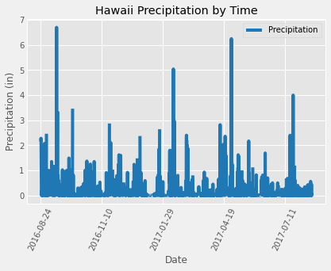

*Fig 1: Precipitation 2016-2017*

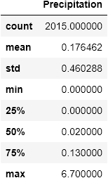

*Table 1: Precipitation Stats 2016-2017*

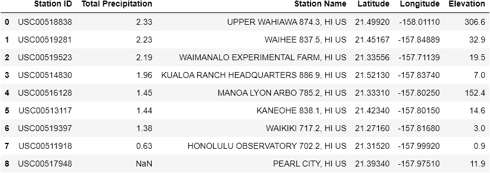

*Table 2: Total precipitation by station for 6-day trip in early March*

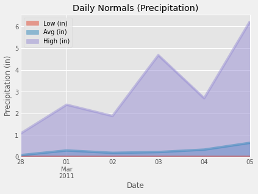

*Fig 2: Precipitation Normals for Trip Date Range*

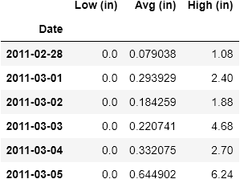

*Table 3:  Precipitation Normals for Trip Date Range*

---
# Temperature Analysis
In addtion to understanding precipitation levels, temperature must also be evaluated to fully understand what needs to be packed for the trip. In Figure 3 and Table 4 we see that daily normal temperature across the state remain relatively flat over the course of the trip with the average daily temperature plotted in Figure 4. In general temperatures remain relatively temperate year-round as seen in Figure 5. Temperatures do fluctuate enough between summer and winter to be statistically significant as seen in Figure 6, and this must be evaluated while planning future trips. 

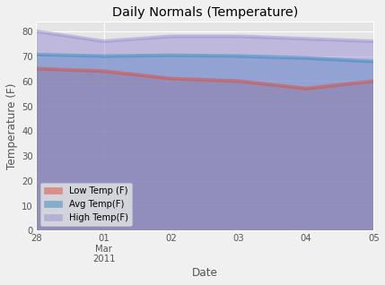

*Figure 3: Area Plot Daily Normals*

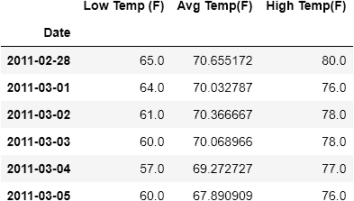

*Table 4: Daily Normals*

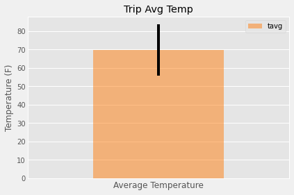

*Figure 4: Average Daily Temperature w/Error Bar*

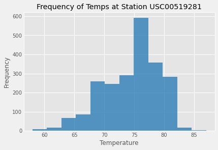

*Figure 5: Temperature Distribution for most active station*

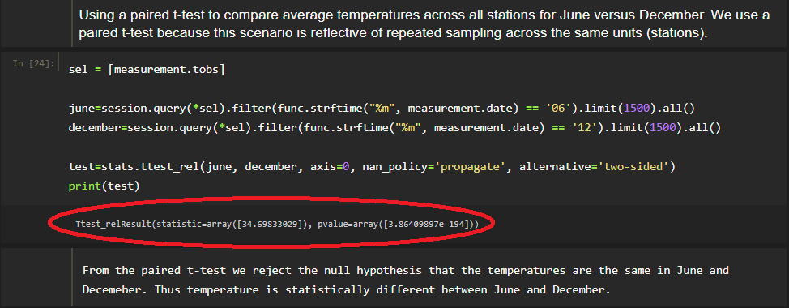

*Figure 6: Paired T-Test Results*

---
# Weather Station Analysis
Researching the source of the weather data is an important analytical step. From analysis of the station information we determine that there are nine (9) weather stations. Table 5 organizes these stations by frequency of reported measurements. Addtional station information may be found in Table 2.

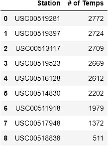

*Table 5: Frequency of temperature data reporting by station*

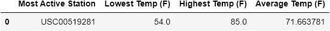

*Table 6: Temperature measures for most active station*

---
# Climate App {Flask API}
Design a Flask API based on the queries developed for the analysis. (see app.py file)

### Routes

 > '/'

    * Home page.
    * List all routes that are available.

> /api/v1.0/precipitation

    * Convert the query results to a dictionary using date as the key and prcp as the value.
    * Return the JSON representation of your dictionary.

> /api/v1.0/stations

    * Return a JSON list of stations from the dataset.

> /api/v1.0/tobs

    * Query the dates and temperature observations of the most active station for the last year of data.
    * Return a JSON list of temperature observations (TOBS) for the previous year.

> /api/v1.0/start_date and /api/v1.0/start_date/end_date

    * Return a JSON list of the minimum temperature, the average temperature, and the max temperature for a given start_date or start_date-end_date range.

    * When given the start_date only, calculate TMIN, TAVG, and TMAX for all dates greater than and equal to the start date. Input dates must be iso format (YYYY-MM-DD).

    * When given the start_date and the end_date, calculate the TMIN, TAVG, and TMAX for dates between the start and end date inclusive. Input dates must be iso format (YYYY-MM-DD).